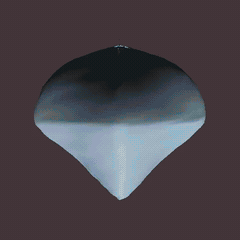
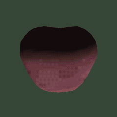
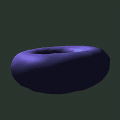
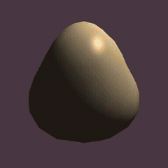
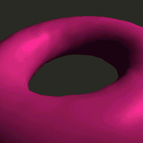

# motionprint

Animated 3D video fingerprints from SHA-256 hash digests.

Motionprint takes any input — a file, a string, a stream — computes its SHA-256 hash, and produces a short animated video of a unique 3D object. The object's shape, color, motion, and lighting are all deterministically derived from the hash. The animation itself traces the internal state evolution of SHA-256's compression rounds, making the video a literal visual encoding of the hash computation.

Same input, same video. Different input, different video. Always.

<table>
<tr>
<td align="center"><code>""</code> (empty)<br><sub>octahedron</sub></td>
<td align="center"><code>"hello world"</code><br><sub>superellipsoid</sub></td>
<td align="center"><code>"Hello, World!"</code><br><sub>torus</sub></td>
<td align="center"><code>"motionprint"</code><br><sub>icosphere</sub></td>
</tr>
<tr>
<td></td>
<td></td>
<td></td>
<td></td>
</tr>
<tr>
<td><sub><code>e3b0c442...7852b855</code></sub></td>
<td><sub><code>b94d27b9...2efcde9</code></sub></td>
<td><sub><code>dffd6021...82986f</code></sub></td>
<td><sub><code>0825dbaa...7f8abe</code></sub></td>
</tr>
</table>

Each input produces a unique shape, color palette, and animation driven by SHA-256's internal round states.

---

## Use Cases

### Identity Verification at a Glance

You distribute a software release. Recipients can run motionprint against the downloaded binary and compare the resulting video against the one you publish. Instead of squinting at 64 hex characters, they watch a few seconds of a rotating teal icosphere with pulsing highlights — or they don't, and they know something is wrong. The human visual system is remarkably good at spotting differences in motion, color, and shape. Motionprint exploits that.

```
motionprint release-v2.4.0.tar.gz --qr -o release-fingerprint.mp4
```

Publish the video alongside your release notes. The embedded QR code lets anyone pause the video and scan with their phone to extract the exact hash — no terminal required. Anyone who downloads the tarball can also run the same command and compare visually or scan-to-verify. A single flipped bit produces a completely different object, color palette, and animation.

### Tamper-Evident Audit Trails

A compliance team needs to verify that a dataset hasn't been modified between pipeline stages. Each stage produces a motionprint of its output. The videos are archived alongside the data. During audit, reviewers scrub through the sequence — if stage 3's fingerprint doesn't match what stage 4 received as input, the visual discontinuity is immediately obvious. No hex comparison tooling required, no specialized training. The difference between a blue twisting torus and a red deformed octahedron is self-evident.

```
cat pipeline-stage-3-output.parquet | motionprint --qr -o stage3.mp4
cat pipeline-stage-4-input.parquet  | motionprint --qr -o stage4-input.mp4
```

With `--qr` enabled, each video carries its own hash in a scannable QR code. Auditors can verify any individual stage by scanning the QR from the video and comparing it to the hash of the corresponding data file, without needing to regenerate the video.

---

## Installation

Requires Python 3.10+ and [ffmpeg](https://ffmpeg.org/download.html).

```bash
git clone <repo-url> && cd motionprint
python3 -m venv .venv && source .venv/bin/activate
pip install -e .
```

Verify ffmpeg is available:

```bash
ffmpeg -version
```

---

## Quick Start

```bash
# Hash a string
motionprint -s "hello world" -o hello.mp4

# Hash a file
motionprint document.pdf

# Pipe from stdin
cat image.png | motionprint -o image-fingerprint.mp4

# With QR code (embedded in video + standalone PNG)
motionprint -s "hello world" --qr -o hello.mp4

# Short preview (2 seconds, lower resolution)
motionprint -s "quick test" -r 640x360 --duration 2 -v
```

Output filename defaults to `motionprint_<first 8 hex chars>.mp4` when `-o` is not specified.

---

## CLI Reference

```
motionprint [-h] [-s STRING] [-o OUTPUT] [-r WxH] [--fps N] [--duration S]
            [--palette NAME] [--primary-color HEX] [--secondary-color HEX]
            [--background-color HEX] [--tempo NAME] [--speed FLOAT]
            [--qr] [-v] [FILE]
```

| Argument | Default | Description |
|----------|---------|-------------|
| `FILE` | — | Input file to hash |
| `-s, --string` | — | Hash a string literal instead of a file |
| `-o, --output` | `motionprint_<hash8>.mp4` | Output video path |
| `-r, --resolution` | `1280x720` | Video resolution (WxH) |
| `--fps` | `30` | Frames per second |
| `--duration` | `6.0` | Video duration in seconds |
| `--palette` | `default` | Named palette: `default`, `vibrant`, `pastel`, `mono`, `sunset`, `cyberpunk`, `ocean` |
| `--primary-color` | — | Override primary color as `#RRGGBB` |
| `--secondary-color` | — | Override secondary color as `#RRGGBB` |
| `--background-color` | — | Override background color as `#RRGGBB` |
| `--tempo` | `normal` | Animation tempo preset: `calm` (0.5×), `normal` (1.0×), `energetic` (2.0×) |
| `--speed` | `1.0` | Animation speed multiplier (0.1–10.0); composes with `--tempo` |
| `--qr` | off | Embed QR code in video and save standalone QR PNG |
| `-v, --verbose` | off | Print SHA-256 digest, shape info, and render progress |

Input priority: `-s` string > `FILE` argument > stdin.

With `--verbose`, output includes:

```
SHA-256: b94d27b9934d3e08a52e52d7da7dabfac484efe37a5380ee9088f7ace2efcde9
Blocks: 1
QR: embedded in video
Shape: superellipsoid (subdivision 2)
Rendering: 60/60 (100%)
Output: motionprint_b94d27b9.mp4
```

The hex digest and output path are always printed to stdout:

```
b94d27b9934d3e08a52e52d7da7dabfac484efe37a5380ee9088f7ace2efcde9  motionprint_b94d27b9.mp4
```

With `--qr`, a standalone QR code PNG is also saved alongside the video:

```
b94d27b9934d3e08a52e52d7da7dabfac484efe37a5380ee9088f7ace2efcde9  motionprint_b94d27b9.mp4
b94d27b9934d3e08a52e52d7da7dabfac484efe37a5380ee9088f7ace2efcde9  motionprint_b94d27b9_qr.png
```

---

## Architecture

```
                        ┌─────────────┐
                        │  Input Data │
                        │ (file/str/  │
                        │   stdin)    │
                        └──────┬──────┘
                               │
                        ┌──────▼──────┐
                        │   cli.py    │
                        │  (argparse) │
                        └──────┬──────┘
                               │ bytes
                        ┌──────▼──────────┐
                        │    scene.py     │
                        │  (orchestrator) │
                        └──┬──┬──┬──┬──┬──┘
            ┌──────────────┘  │  │  │  └──────────────┐
            │          ┌──────┘  │  └──────┐          │
            ▼          ▼         ▼         ▼          ▼
    ┌──────────┐ ┌──────────┐ ┌────────┐ ┌────────┐ ┌─────────┐
    │sha256_   │ │hash_     │ │geometry│ │renderer│ │encoder  │
    │state.py  │ │mapping.py│ │.py     │ │.py     │ │.py      │
    │          │ │          │ │        │ │        │ │         │
    │Pure SHA- │ │Digest →  │ │Mesh    │ │moderngl│ │ffmpeg   │
    │256 with  │ │Visual    │ │gen +   │ │offscr. │ │pipe to  │
    │round-    │ │Params +  │ │deform  │ │render  │ │MP4      │
    │state     │ │keyframe  │ │        │ │        │ │         │
    │capture   │ │interp.   │ │        │ │        │ │         │
    └──────────┘ └──────────┘ └────────┘ └───┬────┘ └─────────┘
                                             │
                                      ┌──────▼──────┐
                                      │  shaders.py │
                                      │ (GLSL 330   │
                                      │  Blinn-     │
                                      │  Phong)     │
                                      └─────────────┘

    ┌────────┐     (optional, with --qr)
    │ qr.py  ├──► QR overlay composited onto each frame
    │        ├──► Standalone QR PNG saved alongside video
    └────────┘
```

### Pipeline Flow

```
                                                     ┌──────────┐
bytes ──► SHA-256 ──► HashResult ──► VisualParams ──►│Frame Loop│──► MP4
          (with         │                  │          └────┬─────┘
          round-state   │  digest bytes    │  per frame:  │
          capture)      │  → static        │  interpolate ├──► deform mesh
                        │    props         │  keyframes   ├──► compute matrices
                        │                  │              ├──► set uniforms
                        │  round states    │              ├──► render (GPU)
                        │  → animation     │              ├──► composite QR (--qr)
                        │    keyframes     │              └──► encode frame
                        ▼                  ▼
                    (num_blocks,      VisualParams
                     64, 8)           dataclass
                    uint32 array
```

---

## How the Hash Maps to Visuals

### Digest Byte Allocation

The 32-byte SHA-256 digest is partitioned into semantic groups that control the static visual identity:

```
Byte:  0  1  2  3  4  5  6  7  8  9  10 11 12 13 14 15 16 17 18 19 20 21 22 23 24 25 26 27 28 29 30 31
       ├──┤  ├──┤  ├─────┤  ├─────┤  ├──┤  ├──┤  │  ├──┤  │  ├──┤  ├────────┤  ├──┤  ├──┤  ├────────┤
       Shape  Sub  Primary  Second.  Bkgd  Light  Wm Camera  Rot.  Deform x4   Spec.  Pulse  Morph
       Index  div. Color    Color    Color  El/Az     R/E/F   Sp/T  Amplitudes  Sh/St  A/F    Seed
```

| Bytes | Property | Derivation |
|-------|----------|------------|
| 0–1 | Base shape | `(b[0]<<8 \| b[1]) % 5` selects geometry |
| 2 | Subdivision level | `2 + (b[2] % 3)` → 2, 3, or 4 |
| 4–6 | Primary color | HSL: H = full range, S = 0.5–1.0, L = 0.35–0.95 |
| 7–9 | Secondary color | Same HSL approach, independent hue |
| 10–11 | Background color | HSL: low saturation, low lightness (dark muted) |
| 12–13 | Light elevation, azimuth | 15–75°, 0–360° |
| 14 | Light warmth | 0–1 blend between cool blue-white and warm amber-white |
| 15–17 | Camera radius, elevation, FOV | 2.5–4.0, -5° to 35°, 40–70° |
| 18–19 | Rotation speed, axis tilt | 0.5–2.5 revolutions, 0–30° off vertical |
| 20–23 | Deformation amplitudes | 4 spherical-harmonic modes, 0–0.3 each |
| 24–25 | Specular shininess, strength | Phong exponent 8–128, intensity 0.2–1.0 |
| 26–27 | Pulse amplitude, frequency | Scale oscillation 0–0.08, 1–5 cycles |
| 28–31 | Morph seed | 4 bytes seeding procedural noise |

### Available Shapes

| Shape | Geometry | Typical Look |
|-------|----------|-------------|
| `icosphere` | Subdivided icosahedron | Smooth organic sphere |
| `torus` | Ring (R=1.0, r=0.4) | Doughnut |
| `superellipsoid` | Parametric (e=0.6) | Rounded cube |
| `octahedron` | Parametric (e=1.5) | Angular diamond |
| `twisted_torus` | Ring (R=1.0, r=0.3, 64 seg) | Thin detailed ring |

### Animation from SHA-256 Round States

SHA-256 processes each 512-bit block through 64 compression rounds. In each round, 8 working variables (a–h) are updated. Motionprint captures these intermediate states and uses them as animation keyframes:

```
SHA-256 Round States                          Animation Channels
┌────────────────────────────┐               ┌──────────────────────────────┐
│ Round  a   b   c  ...  h   │               │                              │
│   0   [██] [░░] [▓▓] [░░] │──normalize──►│  a → deformation blend       │
│   1   [░░] [██] [░░] [▓▓] │   ÷ 2³²      │  b → hue shift (±30°)        │
│   2   [▓▓] [░░] [██] [░░] │              │  c → light orbit offset      │
│  ...                       │──Catmull───►│  d → camera distance pulse   │
│  63   [░░] [▓▓] [░░] [██] │   Rom        │  e → rotation acceleration   │
└────────────────────────────┘  spline      │  f → specular flare          │
        64 keyframes                        │  g → color blend (pri↔sec)   │
                                            │  h → surface noise ripple    │
                                            └──────────────────────────────┘
```

The 64 round states map across the video timeline via Catmull-Rom spline interpolation (C1 continuous), producing smooth organic motion. Multi-block inputs have proportionally more keyframes (128 for 2 blocks, etc.), increasing animation detail without changing duration.

---

## Rendering Pipeline

```
┌────────────────────────────────────────────────────────────────────────┐
│                        Per-Frame Render Cycle                         │
│                                                                       │
│  1. Interpolate keyframes at time t                                   │
│     └─► 8 animated values (deform, hue, light, cam, rot, spec, ...)  │
│                                                                       │
│  2. Deform mesh                                                       │
│     └─► Base vertices + 4 spherical-harmonic modes + noise            │
│     └─► Displacement along normals, recompute normals                 │
│                                                                       │
│  3. Compute transforms                                                │
│     ├─► Model: rotation (tilted axis) × pulse scale                   │
│     ├─► View: look-at from orbiting camera position                   │
│     └─► Projection: perspective (hash-derived FOV)                    │
│                                                                       │
│  4. GPU render (moderngl)                                             │
│     ├─► Upload geometry + uniforms                                    │
│     ├─► Blinn-Phong fragment shader                                   │
│     └─► Read back RGB framebuffer                                     │
│                                                                       │
│  5. Composite QR overlay (--qr)                                       │
│     └─► Pre-rendered QR blitted onto bottom-right corner              │
│                                                                       │
│  6. Pipe frame to ffmpeg                                              │
│     └─► H.264, CRF 18, yuv420p                                       │
└────────────────────────────────────────────────────────────────────────┘
```

### Vertex Deformation

Four spherical-harmonic-like displacement modes create unique organic shapes:

| Mode | Pattern | Visual Effect |
|------|---------|---------------|
| 0 | `cos(2θ)` | Polar flattening/elongation |
| 1 | `sin(θ)·cos(φ)` | Lateral bulge |
| 2 | `sin(2θ)·cos(2φ)` | Diagonal pinching |
| 3 | `cos(3θ)` | Triple-band waviness |

Each mode's amplitude (0–0.3) comes from digest bytes 20–23. The animated `deform_blend` variable (from round-state variable `a`) smoothly fades these deformations in and out over time. An additional high-frequency noise displacement (from variable `h`) adds surface ripple.

### Lighting

Blinn-Phong shading with a single orbiting point light:

- **Ambient**: 15% base illumination
- **Diffuse**: Lambertian, from orbiting light (90° sweep + hash-driven offsets)
- **Specular**: Blinn halfway-vector model, Phong exponent 8–128
- Light color ranges from cool blue-white to warm amber-white based on hash byte 14

---

## Customizing Appearance

By default every visual property is derived from the SHA-256 digest. For presentation, branding, or side-by-side comparison you can select a named **palette** and scale **animation speed** without losing determinism: the same `(input, palette, color overrides, speed)` tuple always produces byte-identical output.

### Named palettes

| Name | Look |
|------|------|
| `default` | Full-range hash-driven HSL (unchanged behavior) |
| `vibrant` | Saturated, mid-lightness primary and secondary |
| `pastel` | Soft, high-lightness colors |
| `mono` | Near-grayscale primary/secondary, hash-driven background |
| `sunset` | Warm oranges with magenta/pink accent |
| `cyberpunk` | Magenta + cyan primaries on a deep-blue muted ground |
| `ocean` | Blue/teal gradient in both primary and secondary |

Hash bytes still drive variation inside each preset's H/S/L bands, so two different inputs rendered under the same palette remain visually distinct.

```bash
# Use a named preset
motionprint -s "hello" --palette vibrant -o hello-vibrant.mp4

# Combine palette and animation tempo
motionprint -s "hello" --palette cyberpunk --tempo energetic -o hello-cp.mp4

# Custom primary + secondary colors (hex overrides beat the preset)
motionprint -s "hello" --primary-color '#ff3388' --secondary-color '#33ccff' -o hello-brand.mp4

# Muted look, slightly slower
motionprint -s "hello" --palette mono --speed 0.75 -o hello-mono.mp4
```

### Speed control

`--speed` is a floating-point multiplier (0.1–10.0) applied to cyclic motion — rotation, pulse, camera orbit, and light orbit. `--tempo` selects a named preset (`calm` = 0.5×, `normal` = 1.0×, `energetic` = 2.0×) and **composes** with `--speed` multiplicatively. So `--tempo energetic --speed 0.5` yields an effective multiplier of 1.0.

Keyframe traversal — the animation channels driven by SHA-256's round-state evolution — always spans the full video duration exactly once regardless of speed. This preserves the "animation as hash visualization" narrative while letting you tune the perceived pace.

### HTTP service parity

The Rust service exposes the same knobs as query parameters. All of these default to values that reproduce the legacy output, so existing callers are unaffected.

```
GET /v1/motionprint/<sha256_hex>
    ?palette=ocean
    &primary_color=%23ff3388
    &secondary_color=%2333ccff
    &background_color=%23101018
    &tempo=energetic
    &speed=1.5
```

```bash
curl 'http://localhost:8080/v1/motionprint/b94d27b9.../?palette=sunset&speed=1.25' -o sunset.webm
```

Palette name, hex overrides, and the final speed multiplier are all folded into the response cache key, so palette variations are cached independently.

---

## Verification

Motionprint provides two complementary verification methods: visual comparison of the 3D animation, and QR-code-based hash extraction.

### QR Code Verification

When generated with `--qr`, each video embeds a scannable QR code in the bottom-right corner encoding the full SHA-256 hex digest. A standalone PNG of the QR code is also saved alongside the video.

```
┌─────────────────────────────────────────────┐
│                                             │
│           ┌───────────────┐                 │
│           │               │                 │
│           │   3D Object   │                 │
│           │   (animated)  │                 │
│           │               │                 │
│           └───────────────┘                 │
│                                    ┌──────┐ │
│                                    │ ▄▄▄▄ │ │
│                                    │ █  █ │ │
│                                    │ ▀▀▀▀ │ │
│                                    └──────┘ │
└─────────────────────────────────────────────┘
 Video frame with QR overlay (bottom-right)
```

**Verification workflow:**

```
Producer                              Verifier
────────                              ────────

motionprint data.bin --qr             ① Receive video + data
        │                             ② Pause video, scan QR with phone
        ▼                                → extracts: b94d27b9934d...
  ┌──────────┐    share
  │ video.mp4│ ──────────►            ③ Hash the received data:
  │ video_qr │                           motionprint data.bin
  │   .png   │                              → prints: b94d27b9934d...
  └──────────┘
                                      ④ Compare: QR hash == computed hash?
                                         ✓ Match → data is authentic
                                         ✗ Mismatch → data was modified
```

The QR code provides a bridge between the video and machine-readable verification. Scan with any phone camera or QR reader — no special software needed. The digest is also always printed to stdout for scripted comparison.

**Outputs with `--qr`:**

| File | Contents |
|------|----------|
| `motionprint_<hash8>.mp4` | Video with QR code overlay in every frame |
| `motionprint_<hash8>_qr.png` | Standalone QR code image (370x370 px at default resolution) |

The QR code uses error correction level M (recovers up to 15% damage), ensuring reliable scanning even from compressed video frames or printed screenshots.

### Visual Comparison

Two motionprints of the same content are byte-identical. Two motionprints of different content differ across multiple visual dimensions simultaneously — even when the inputs differ by a single character:

<table>
<tr>
<td align="center"><code>"hello world"</code><br><sub>superellipsoid, warm palette</sub></td>
<td align="center"><code>"Hello world"</code><br><sub>torus, cool palette</sub></td>
</tr>
<tr>
<td></td>
<td></td>
</tr>
<tr>
<td><sub><code>b94d27b9...2efcde9</code></sub></td>
<td><sub><code>64ec88ca...a37f3c</code></sub></td>
</tr>
</table>

A single capitalized letter produces an entirely different shape, color, and motion. This is the avalanche effect of SHA-256 made visible.

**Shape**: The base geometry is one of 5 types. Even within the same type, deformation amplitudes create meaningfully different silhouettes. A hash that produces a torus will never be confused with one that produces an icosphere, and two icospheres with different deformation profiles will have visibly different contours.

**Color**: Primary and secondary colors are chosen from the full HSL hue wheel with enforced saturation (0.5–1.0) and lightness (0.35–0.95) to guarantee vivid, distinguishable palettes. The two colors blend dynamically during animation. Background colors are intentionally dark and muted to maximize object contrast.

**Motion**: The animation is driven by SHA-256's internal round-state evolution — not random, not periodic, but a deterministic traversal of the compression function's state space. This produces non-repeating, organic-feeling motion that is unique to each hash. Key motion signatures:

- **Rotation speed and axis**: How fast and at what angle the object spins
- **Deformation breathing**: The object morphing between a base shape and its deformed state
- **Color shifting**: Hue and primary/secondary blend evolving over time
- **Specular flare**: Highlights brightening and dimming
- **Surface ripple**: High-frequency vertex noise creating texture shimmer
- **Camera drift**: Subtle zoom in/out following round-state variable `d`

### Quick Comparison Checklist

When comparing two motionprints:

1. **Different shape type?** → Different hash (immediate)
2. **Same shape, different color palette?** → Different hash
3. **Same shape and color, different motion pattern?** → Different hash
4. **Identical across all dimensions for full duration?** → Same hash
5. **QR codes scan to different digests?** → Different hash (definitive)

For programmatic verification, the hex digest is printed to stdout and can be compared directly:

```bash
# Compare two inputs by their motionprint digests
diff <(motionprint -s "file A" 2>/dev/null | cut -d' ' -f1) \
     <(motionprint -s "file B" 2>/dev/null | cut -d' ' -f1)
```

---

## Technical Details

### Dependencies

| Package | Version | Purpose |
|---------|---------|---------|
| moderngl | ≥5.8 | Offscreen OpenGL 3.3 rendering |
| numpy | ≥1.24 | Array math, mesh data |
| pyrr | ≥0.10 | 3D matrix operations (MVP, look-at, perspective) |
| qrcode | ≥7.0 | QR code matrix generation |
| ffmpeg | (system) | Video encoding (H.264) |

### Video Encoding

- **Codec**: H.264 (libx264)
- **Quality**: CRF 18 (visually lossless)
- **Pixel format**: yuv420p (universal playback compatibility)
- **Preset**: medium (balanced speed/compression)
- **Container**: MP4 with `+faststart` for streaming

### SHA-256 State Capture

Motionprint includes a pure-Python SHA-256 implementation (FIPS 180-4) that captures the 8 working variables `(a, b, c, d, e, f, g, h)` after each of the 64 compression rounds per block. This is necessary because `hashlib` wraps OpenSSL and exposes no intermediate state.

The implementation is verified against `hashlib.sha256()` across NIST test vectors and arbitrary inputs. Performance is not a concern — SHA-256 is only computed once per invocation on the input data, not on the video frames.

```
Input "hello world" (11 bytes)
  → 1 padded block (512 bits)
  → 64 rounds × 8 variables = 512 state values
  → 64 animation keyframes

Input of 1 KB
  → ~16 blocks
  → 1024 rounds × 8 variables = 8192 state values
  → 1024 animation keyframes (higher temporal resolution)
```

### Determinism

Motionprint is fully deterministic. The output is determined by the tuple `(input bytes, palette, primary/secondary/background hex overrides, final speed multiplier)` — any combination of these produces a byte-identical video on re-run. In particular, the default palette with `--speed 1.0` (and `--tempo normal`) reproduces the pre-palette hash-driven output exactly. Determinism is ensured by:

- Pure SHA-256 implementation with no external state
- Fixed random seed for noise (derived from digest bytes 28–31)
- Deterministic GPU rendering (same geometry, same uniforms, same result)
- Deterministic ffmpeg encoding (fixed parameters, no rate control adaptation)
- Palette presets and overrides applied through pure functions with no hidden state

---

## Development

```bash
# Install with dev dependencies
pip install -e ".[dev]"

# Run tests
pytest tests/ -v

# Run a quick smoke test
motionprint -s "test" --duration 2 -r 640x360 -v
```

### Project Layout

```
src/motionprint/
├── sha256_state.py     Pure SHA-256 with round-state capture
├── hash_mapping.py     32-byte digest → VisualParams + keyframe interpolation
├── palette.py          Named palette presets + hex overrides → apply_palette
├── geometry.py         Icosphere/torus/superellipsoid generation + deformation
├── shaders.py          GLSL 330 vertex + fragment shaders (Blinn-Phong)
├── renderer.py         moderngl offscreen context, framebuffer, render loop
├── encoder.py          ffmpeg subprocess pipe (raw RGB → H.264 MP4)
├── qr.py               QR generation, frame compositing, standalone PNG export
├── scene.py            Orchestrator: hash → map → mesh → render → encode
└── cli.py              argparse entry point
```

---

## License

MIT
